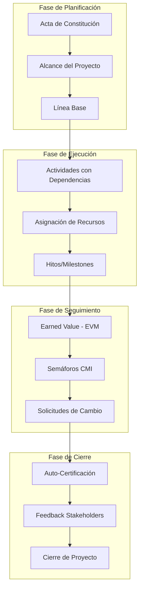
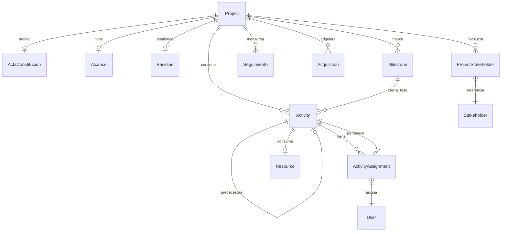

# Plan de Transformación CMI - GAD Municipal de Célica

## Resumen Ejecutivo

Este documento detalla la transformación del sistema actual de CRUDs aislados hacia un sistema de gestión estratégica integrado basado en el Cuadro de Mando Integral (CMI) para el GAD Municipal de Célica.

---

## 1. Análisis del Estado Actual

### 1.1 Modelos Existentes

| Modelo | Propósito | Estado |
|--------|-----------|--------|
| Project | Proyectos principales | Funcional, sin validaciones |
| Activity | Actividades de proyecto | Sin validaciones de fecha/costo |
| Milestone | Hitos de proyecto | Funcional básico |
| Stakeholder | Interesados | Sin integración con proyectos |
| Resource | Recursos | Sin cálculo de costos |
| Risk | Riesgos | Sin matriz de impacto |
| Seguimiento | Seguimiento EVM | Cálculos básicos |
| ActaConstitucion | Acta de constitución | Sin integración con alcance |

### 1.2 Problemas Identificados

1. **Desconexión entre módulos**: Los CRUDs operan de forma aislada
2. **Sin validaciones de negocio**: Fechas y costos sin restricciones
3. **Dashboard informativo solo**: No hay indicadores estratégicos dinámicos
4. **UX/UI inconsistente**: Formularios desalineados, navegación incompleta
5. **Sin trazabilidad**: Falta cadena de dependencias entre tareas

---

## 2. Arquitectura Propuesta

### 2.1 Diagrama de Flujo CMI



### 2.2 Modelo de Datos Mejorado



---

## 3. Fase 1: Mejoras de Interfaz y Usabilidad

### 3.1 Alineación de Formularios

**Archivos a modificar:**
- `templates/projects/project_form.html`
- `templates/projects/activity_form.html`
- `templates/projects/milestone_form.html`
- `templates/stakeholders/stakeholder_form.html`

**Cambios:**
1. Implementar sistema de grid Bootstrap consistente
2. Agrupar campos relacionados en secciones visuales
3. Añadir iconos descriptivos a cada campo
4. Implementar validación visual en tiempo real

### 3.2 Navegación Fluida

**Botones Regresar en todas las vistas:**
- Añadir botón consistente en todos los formularios de creación/edición
- Implementar breadcrumb navigation en `base.html`
- Crear helper de navegación centralizado

### 3.3 Consolidación de Datos

**Correcciones en Dashboard:**
- Unificar nombres de proyectos entre lista y dashboard
- Implementar caché de consultas frecuentes
- Añadir indicadores de carga

---

## 4. Fase 2: Lógica de Negocio y Validaciones Críticas

### 4.1 Restricción de Fechas

**Modelo Activity - Validaciones:**

```python
# En projects/models.py - Activity.clean()
def clean(self):
    errors = {}
    
    # Validación 1: Fechas dentro del rango del proyecto
    if self.start_date and self.project.start_date:
        if self.start_date < self.project.start_date:
            errors['start_date'] = 'La fecha de inicio no puede ser anterior al inicio del proyecto'
    
    if self.end_date and self.project.end_date:
        if self.end_date > self.project.end_date:
            errors['end_date'] = 'La fecha de fin no puede ser posterior al fin del proyecto'
    
    # Validación 2: Fecha inicio < Fecha fin
    if self.start_date and self.end_date:
        if self.start_date > self.end_date:
            errors['start_date'] = 'La fecha de inicio no puede ser posterior a la fecha de fin'
    
    if errors:
        raise ValidationError(errors)
```

### 4.2 Control Presupuestario

**Modelo Activity - Validación de Costo:**

```python
# En projects/models.py - Activity.clean()
def clean(self):
    # ... validaciones de fecha ...
    
    # Validación de costo vs presupuesto
    if self.cost and self.project.budget:
        total_activities_cost = Activity.objects.filter(
            project=self.project
        ).exclude(pk=self.pk).aggregate(
            total=Sum('cost')
        )['total'] or 0
        
        if total_activities_cost + self.cost > self.project.budget:
            disponible = self.project.budget - total_activities_cost
            errors['cost'] = f'Costo excede el presupuesto. Disponible: ${disponible:,.2f}'
```

### 4.3 Cadenas de Dependencia

**Nuevo campo en Activity:**

```python
# En projects/models.py
class Activity(models.Model):
    # ... campos existentes ...
    predecessor = models.ForeignKey(
        'self',
        on_delete=models.SET_NULL,
        null=True,
        blank=True,
        verbose_name='Actividad Predecesora',
        related_name='successors'
    )
    
    def clean(self):
        # Validar que no haya ciclos de dependencia
        if self.predecessor:
            visited = set()
            current = self.predecessor
            while current:
                if current.pk == self.pk:
                    raise ValidationError({'predecessor': 'No se pueden crear ciclos de dependencia'})
                if current.pk in visited:
                    break
                visited.add(current.pk)
                current = current.predecessor
```

### 4.4 Asignación Múltiple de Personal

**Nuevo modelo intermedio:**

```python
# En projects/models.py
class ActivityAssignment(models.Model):
    activity = models.ForeignKey(Activity, on_delete=models.CASCADE, verbose_name='Actividad')
    user = models.ForeignKey(User, on_delete=models.CASCADE, verbose_name='Responsable')
    role = models.CharField(max_length=50, verbose_name='Rol en la Actividad')
    hours_assigned = models.PositiveIntegerField(verbose_name='Horas Asignadas')
    
    class Meta:
        unique_together = ['activity', 'user']
        verbose_name = 'Asignación de Actividad'
        verbose_name_plural = 'Asignaciones de Actividades'
```

---

## 5. Fase 3: Módulos de Visualización Estratégica

### 5.1 Diagrama de Gantt Mejorado

**Mejoras al template existente:**
- Mostrar dependencias entre tareas con conectores visuales
- Implementar zoom y navegación temporal
- Añadir hitos como marcadores especiales
- Colorear por estado y responsable

**Vista Gantt con dependencias:**

```javascript
// En templates/reports/gantt.html
series: [{
    name: 'Actividades',
    data: [
        
        {
            name: '{{ activity.name }}',
            id: 'act_{{ activity.id }}',
            start: Date.UTC(...),
            end: Date.UTC(...),
            color: '#28a745#007bff',
            parent: 'act_{{ activity.predecessor.id }}'null
        },
        
    ]
}]
```

### 5.2 Gestión de Hitos Mejorada

**Lógica de Hitos por Fase:**

```python
# En projects/models.py - Milestone
class Milestone(models.Model):
    PHASE_CHOICES = [
        ('initiation', 'Inicio'),
        ('planning', 'Planificación'),
        ('execution', 'Ejecución'),
        ('monitoring', 'Monitoreo y Control'),
        ('closure', 'Cierre'),
    ]
    
    phase = models.CharField(max_length=20, choices=PHASE_CHOICES, verbose_name='Fase')
    is_phase_gate = models.BooleanField(default=False, verbose_name='Es Cierre de Fase')
    activities = models.ManyToManyField(Activity, verbose_name='Actividades Asociadas')
    
    def check_completion(self):
        """Verifica si todas las actividades asociadas están completas"""
        return not self.activities.filter(status__in=['pending', 'in_progress']).exists()
```

### 5.3 Semáforos CMI Dinámicos

**Cálculo de indicadores:**

```python
# En projects/models.py - Project
def get_traffic_light_status(self):
    """
    Calcula el estado del semáforo basado en SPI y CPI
    Verde: SPI >= 0.95 y CPI >= 0.95
    Amarillo: SPI >= 0.85 y CPI >= 0.85
    Rojo: Cualquier otro caso
    """
    try:
        latest_seguimiento = self.seguimiento_set.first()
        if not latest_seguimiento:
            return 'gray'  # Sin datos
        
        spi = latest_seguimiento.spi
        cpi = latest_seguimiento.cpi
        
        if spi >= 0.95 and cpi >= 0.95:
            return 'green'
        elif spi >= 0.85 and cpi >= 0.85:
            return 'yellow'
        else:
            return 'red'
    except:
        return 'gray'
```

**Dashboard con semáforos:**

```html
<!-- En templates/projects/dashboard.html -->
<div class="traffic-light">
    
        <div class="light {{ status }}">
            🟢 En Tiempo y Presupuesto
            🟡 Atención Requerida
            🔴 Crítico
            ⚪ Sin Datos
        </div>
    
</div>
```

---

## 6. Fase 4: Recursos y Seguimiento Financiero

### 6.1 Cálculo Automático de Costos

**Método en Project:**

```python
# En projects/models.py - Project
@property
def total_activities_cost(self):
    """Suma de costos de todas las actividades"""
    return self.activity_set.aggregate(
        total=Sum('cost')
    )['total'] or 0

@property
def total_resources_cost(self):
    """Suma de costos de todos los recursos"""
    from resources.models import Resource
    return Resource.objects.filter(
        activity__project=self
    ).aggregate(
        total=Sum(F('quantity') * F('cost_per_unit'), output_field=DecimalField())
    )['total'] or 0

@property
def total_actual_cost(self):
    """Costo real total del proyecto"""
    return self.total_activities_cost + self.total_resources_cost

@property
def budget_variance(self):
    """Diferencia entre presupuesto y costo real"""
    if self.budget:
        return self.budget - self.total_actual_cost
    return None

@property
def budget_utilization_percentage(self):
    """Porcentaje de utilización del presupuesto"""
    if self.budget and self.budget > 0:
        return (self.total_actual_cost / self.budget) * 100
    return 0
```

### 6.2 Vista de Costos Consolidados

**Nueva vista en views.py:**

```python
@login_required
def project_financial_summary(request, pk):
    project = get_object_or_404(Project, pk=pk, created_by=request.user)
    
    context = {
        'project': project,
        'budget': project.budget,
        'activities_cost': project.total_activities_cost,
        'resources_cost': project.total_resources_cost,
        'total_cost': project.total_actual_cost,
        'variance': project.budget_variance,
        'utilization': project.budget_utilization_percentage,
        'activities': project.activity_set.annotate(
            resource_cost=Sum(
                F('resource__quantity') * F('resource__cost_per_unit'),
                output_field=DecimalField()
            )
        ),
    }
    return render(request, 'projects/financial_summary.html', context)
```

---

## 7. Cronograma de Implementación

### Fase 1: UX/UI - Semana 1-2
- [ ] Corregir alineación de formularios
- [ ] Implementar botones de regresar
- [ ] Unificar estilos y navegación
- [ ] Corregir rutas de imágenes estáticas

### Fase 2: Validaciones - Semana 3-4
- [ ] Implementar validación de fechas en Activity
- [ ] Implementar control presupuestario
- [ ] Añadir campo predecessor a Activity
- [ ] Crear modelo ActivityAssignment
- [ ] Migraciones de base de datos

### Fase 3: Visualización - Semana 5-6
- [ ] Mejorar diagrama Gantt con dependencias
- [ ] Implementar lógica de hitos por fase
- [ ] Desarrollar semáforos CMI dinámicos
- [ ] Crear vista de resumen financiero

### Fase 4: Integración - Semana 7-8
- [ ] Integrar todos los módulos
- [ ] Pruebas de integración
- [ ] Documentación de usuario
- [ ] Despliegue a producción

---

## 8. Archivos a Modificar/Crear

### 8.1 Archivos a Modificar

| Archivo | Cambios |
|---------|---------|
| `projects/models.py` | Validaciones, nuevos campos, propiedades calculadas |
| `projects/forms.py` | Formularios con validaciones personalizadas |
| `projects/views.py` | Nuevas vistas, lógica de cálculo |
| `projects/urls.py` | Nuevas rutas |
| `templates/projects/dashboard.html` | Semáforos, indicadores |
| `templates/projects/activity_form.html` | Campo predecesora, asignaciones |
| `templates/reports/gantt.html` | Dependencias visuales |

### 8.2 Archivos a Crear

| Archivo | Propósito |
|---------|-----------|
| `templates/projects/financial_summary.html` | Resumen financiero |
| `migrations/XXXX_add_activity_dependencies.py` | Migración de nuevos campos |
| `templates/projects/includes/traffic_light.html` | Componente semáforo reutilizable |

---

## 9. Consideraciones Técnicas

### 9.1 Compatibilidad
- Django 6.0.2 actualmente instalado
- Base de datos SQLite (considerar migración a PostgreSQL para producción)
- Bootstrap 5 para UI

### 9.2 Rendimiento
- Implementar `select_related` y `prefetch_related` en consultas
- Considerar caché para cálculos de EVM
- Paginación para listados extensos

### 9.3 Seguridad
- Mantener decoradores de permisos existentes
- Validar permisos en nuevas vistas
- Sanitizar entradas de usuario

---

## 10. Próximos Pasos

1. **Aprobación del Plan**: Revisar y aprobar este documento
2. **Inicio Fase 1**: Comenzar con mejoras de UX/UI
3. **Iteraciones**: Seguir ciclo de desarrollo iterativo
4. **Revisiones**: Puntos de control al final de cada fase

---

*Documento preparado por: Arquitecto de Software Senior*
*Fecha: Febrero 2026*
*Versión: 1.0*
